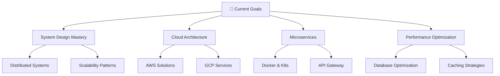

<div align="center">

# Hi there, I'm Ashiq 👨‍💻


[](https://github.com/ashiqali9136)

</div>

---

## 🚀 About Me

```javascript
const ashiq = {
    pronouns: "he" | "him",
    code: ["JavaScript", "TypeScript", "Python", "Java"],
    askMeAbout: ["web dev", "tech", "app dev", "system design"],
    technologies: {
        frontEnd: {
            js: ["React", "Next.js", "Redux", "Zustand"],
            css: ["Tailwind CSS", "Styled Components", "Material-UI"]
        },
        backEnd: {
            js: ["Node.js", "Express.js", "Nest.js"],
            python: ["Django", "FastAPI"],
            databases: ["MongoDB", "PostgreSQL", "Redis"],
            cloudServices: ["AWS", "GCP", "Firebase"]
        },
        devOps: ["Docker", "Kubernetes", "GitHub Actions", "Jenkins"],
        databases: ["MongoDB", "PostgreSQL", "MySQL", "Redis"],
        misc: ["Socket.io", "GraphQL", "REST APIs", "Microservices"]
    },
    architecture: ["Serverless Architecture", "Progressive Web Apps", "Single Page Applications"],
    currentFocus: "Building scalable applications with modern architecture patterns",
    funFact: "I debug with console.log() and I'm not ashamed of it! 🚀"
};
```

<div align="center">

## 🛠️ Tech Stack & Tools

### Frontend Technologies


### Backend Technologies


### Cloud & DevOps


### Development Tools


</div>

---

## 📊 GitHub Analytics

<div align="center">
  
  
</div>

<div align="center">
  
</div>

<div align="center">
  
</div>

---

## 🎯 Current Focus

<div align="center">



</div>

---

## 🏆 GitHub Trophies

<div align="center">

[](https://github.com/ryo-ma/github-profile-trophy)

</div>

---

## 📈 Contribution Graph

<div align="center">


</div>

---

## 🌐 Let's Connect

<div align="center">

[![LinkedIn](https://img.shields.io/badge/LinkedIn-0077B5?style=for-the-badge&logo=link
